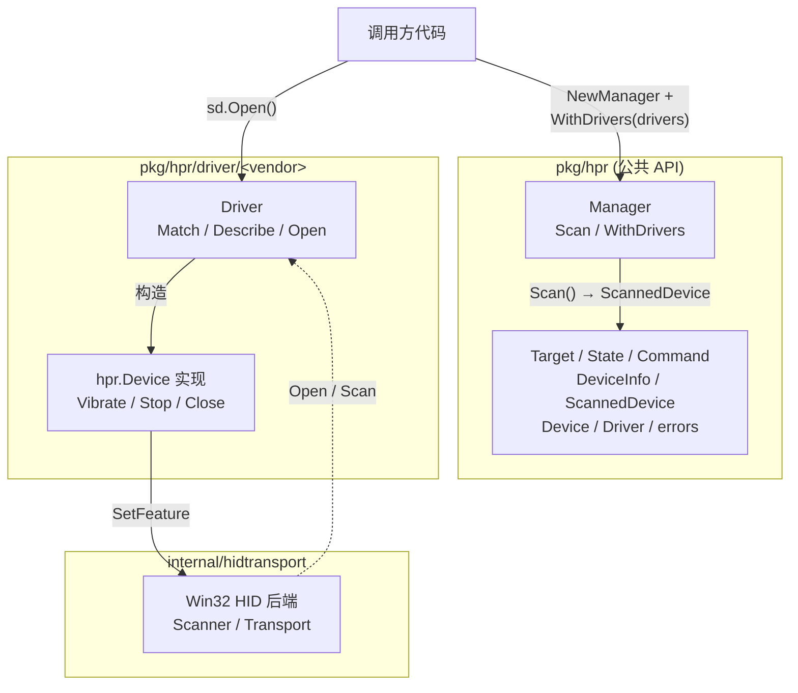

# tracklogic-peripherals

赛车模拟器外设的 Go 驱动库。

仓库包含两类相互独立的能力：`pkg/hpr` 负责厂家相关的踏板振动输出，`pkg/controller` 通过 Windows DirectInput 提供厂家无关的游戏控制器数字按钮与模拟轴输入。

振动调用方构造 `hpr.Manager`，注册一个或多个厂家驱动，调 `Scan` 拿到当前可用的设备列表，再对每个 `ScannedDevice` 调 `Open` 拿一个 `hpr.Device` 来发振动命令。厂家驱动作为 `pkg/hpr/driver/<vendor>/` 子包存在，是调用方和真实硬件之间的薄薄一层。

驱动作者的责任只有三件事：

1. **`Match`** — 根据 `DeviceInfo`（VID/PID/Usage/FriendlyName）判断这个 Driver 是否认领该设备。
2. **`Describe`** — 给 `DeviceInfo` 填厂家私有字段（通常是 `Model`，让调用方能识别型号）。
3. **`Open`** — 拿到 `DeviceInfo`，自己开 transport，构造 `hpr.Device` 实例返回。后续 transport 的关闭由 `Device.Close` 负责。

调用方和驱动作者都看不到彼此的细节：`hpr` 包对厂家和外设种类都无感，厂家包对上层如何暴露也无需关心。详见下面的 [扩展：编写新驱动](#扩展编写新驱动)。

## 状态

**v1.0.0** — 仅 Windows。当前已支持的设备：

| 厂家    | 包                       | 型号                                          |
| ------- | ------------------------ | --------------------------------------------- |
| Simagic | `pkg/hpr/driver/simagic` | P500、P700、P1000、P2000、Alpha Pedal Neo     |

控制器输入不使用厂家表：Windows DirectInput 能枚举到的游戏控制器都由 `pkg/controller` 统一提供 0–127 数字按钮的按下/松开事件，以及归一化的绝对模拟轴事件。

## 安装

```sh
go get github.com/apexracing/tracklogic-peripherals
```

## 快速上手

```go
package main

import (
    "log"
    "time"

    "github.com/apexracing/tracklogic-peripherals/pkg/hpr"
    "github.com/apexracing/tracklogic-peripherals/pkg/hpr/driver/simagic"
)

func main() {
    mgr := hpr.NewManager(hpr.WithDrivers(simagic.NewDriver()))

    devices, err := mgr.Scan()
    if err != nil || len(devices) == 0 {
        log.Fatal("未找到设备")
    }

    dev, err := devices[0].Open()
    if err != nil {
        log.Fatal(err)
    }
    defer dev.Close()

    if err := dev.Vibrate(hpr.Command{
        Target:    hpr.TargetBrake,
        State:     hpr.On,
        Frequency: 30,
        Amplitude: 80,
    }); err != nil {
        log.Fatal(err)
    }

    time.Sleep(time.Second)
    dev.Stop(hpr.TargetBrake)
}
```

完整步骤：

1. `NewManager` 构造
2. `WithDrivers(...)` 注册要识别的厂家驱动
3. `Scan` 拿设备列表
4. 选一个 `ScannedDevice`，调它的 `Open` 拿到 `Device`
5. `Vibrate` / `Stop` / `Close`

## DirectInput 按钮与模拟轴

`controller.Manager` 使用后台、非独占 DirectInput，不会抢占游戏中的方向盘或踏板。它统一枚举每个游戏控制器上的数字按钮和绝对模拟轴，因此油门、刹车、离合可以来自独立踏板，也可以来自方向盘或基座。TrackLogic 应在 Wails 原生主窗口创建后传入 HWND，并在窗口销毁前关闭 Manager：

```go
import (
    "context"

    "github.com/apexracing/tracklogic-peripherals/pkg/controller"
)

ctx, cancel := context.WithCancel(context.Background())
defer cancel()

buttons := controller.NewManager(
    controller.WithWindowHandle(uintptr(mainWindow.NativeWindow())),
)
if err := buttons.Start(ctx); err != nil {
    return err
}
defer buttons.Close() // 必须早于 mainWindow 的销毁

binding, err := buttons.Capture(ctx) // 设置页：等待下一次按下
if err != nil {
    return err
}

go func() {
    for event := range buttons.Events() {
        if !binding.Matches(event) {
            continue
        }
        switch event.State {
        case controller.Pressed:
            asr.StartCapture()
        case controller.Released:
            audio := asr.StopCapture()
            go transcribeAndInvokeAgent(audio)
        }
    }
}()
```

传入窗口必须是当前进程拥有的顶层窗口，并且在 Manager 生命周期内保持有效。主窗口可以隐藏或最小化；不要传会按 HUD 模式关闭、重建的窗口。没有传 `WithWindowHandle` 时，库会创建自己的隐藏顶层窗口，适合 CLI 和测试工具。

`Binding.Button` 和 `ButtonEvent.Button` 都是 DirectInput 的零基编号；设置界面通常显示为 `Button + 1`。绑定持久化由 TrackLogic 负责。

模拟轴使用独立事件流和捕获方法，不会改变已有按钮绑定行为：

```go
axisBinding, err := buttons.CaptureAxis(ctx) // 从当前位置移动到接近满行程（默认 95%）
if err != nil {
    return err
}

go func() {
    active := false
    for event := range buttons.AxisEvents() {
        if !axisBinding.Matches(event) {
            continue
        }
        travel := axisBinding.Travel(event) // 沿绑定方向，从捕获基线到端点的 0..1 行程
        if !active && travel >= 0.50 {
            active = true
            // 触发动作
        } else if active && travel <= 0.40 {
            active = false
            // 释放动作
        }
    }
}()
```

`AxisEvent.Value` 是 `0..1` 归一化绝对位置。`AxisBinding` 保存设备 Instance GUID、轴实例、显示名称、捕获基线和移动方向；`Travel` 会处理正向、反向以及静止点在中间的半轴踏板，并把基线到对应端点重新归一化为 `0..1`。`CaptureAxis` 默认只在轴达到 95% 行程且绝对变化至少为 20% 时完成，避免端点附近的微小残余变化被误判为满行程；可用 `WithAxisCaptureThreshold` 修改方向行程阈值。调用 `AxisEvents()` 后必须持续读取该通道。

## 命令行示例

`examples/hpr-demo` 是可独立运行的示例程序，`go run` 或 `go build` 都行：

```sh
go run ./examples/hpr-demo -list
go run ./examples/hpr-demo -ch 1 -f 30 -a 80 -d 2s

go build -o hpr-demo.exe ./examples/hpr-demo
./hpr-demo.exe -list
```

DirectInput 按钮和模拟轴诊断：

```sh
go run ./examples/controller-demo -list
go run ./examples/controller-demo -bind
go run ./examples/controller-demo -bind-axis
go run ./examples/controller-demo -monitor
go run ./examples/controller-demo -monitor-axis
go run ./examples/controller-demo -test-pedals
```

## 公共 API

`pkg/hpr` 包对外的振动 API：

```go
// 命令数据
type Target uint8           // TargetClutch / TargetBrake / TargetThrottle
type State uint8            // Off / On
type Command struct {       // Vibrate 的入参
    Target    Target
    State     State
    Frequency uint8         // 0..50
    Amplitude uint8         // 0..100
}

// 设备视图
type DeviceInfo struct {    // Scan 返回的描述
    Model          any      // 厂家私有（type-assert 到 simagic.Model 等）
    DevicePath     string
    FriendlyName   string
    Manufacturer   string
    Product        string
    VendorID       uint16
    ProductID      uint16
    VersionNumber  uint32
    UsagePage      uint16
    Usage          uint16
}

type ScannedDevice struct { // Scan 返回
    Info DeviceInfo
    Open func() (Device, error)
}

type Device interface {     // Open 返回
    Info() DeviceInfo
    Vibrate(Command) error
    Stop(Target) error
    Close() error
}

type Driver interface {     // 注册到 Manager 的扩展点
    Match(DeviceInfo) bool
    Describe(DeviceInfo) DeviceInfo
    Open(DeviceInfo) (Device, error)
}

// 入口
func NewManager(opts ...Option) *Manager
func WithDrivers(drivers ...Driver) Option
func (m *Manager) Scan() ([]ScannedDevice, error)

// 错误
var ErrNoDevices = ...
var ErrDeviceClosed = ...
var ErrUnsupported = ...
```

整个 surface 就这些。

`pkg/controller` 的输入 API 由 `DeviceInfo`、`ButtonEvent`、`Binding`、`AxisEvent`、`AxisBinding`、`AxisDirection` 和 `Manager` 组成；详见上面的 DirectInput 示例及 Go 文档。

## 架构



驱动作者只看到左侧的 `Driver` 接口和右侧的 `hidtransport` Win32 API：`pkg/hpr` 对厂家无知，`internal/hidtransport` 对上层无知。中间的 driver 包是同时 import 二者的那一层。

## 扩展：编写新驱动

```go
package myvendor

import (
    "github.com/apexracing/tracklogic-peripherals/internal/hidtransport"
    "github.com/apexracing/tracklogic-peripherals/pkg/hpr"
)

type Driver struct{}

func NewDriver() *Driver { return &Driver{} }

// Match: 这个 Driver 认领哪些设备
func (Driver) Match(info hpr.DeviceInfo) bool {
    // 按 VID/PID / Usage / FriendlyName 判断
    return info.VendorID == 0x1234 && info.ProductID == 0x5678
}

// Describe: 给 DeviceInfo 填厂家私有字段（通常是 Model）
func (Driver) Describe(info hpr.DeviceInfo) hpr.DeviceInfo {
    info.Model = ModelMyProduct
    return info
}

// Open: 拿到一个 hpr.Device，自己负责 transport 生命周期
func (Driver) Open(info hpr.DeviceInfo) (hpr.Device, error) {
    t, err := hidtransport.Open(hidtransport.DeviceDescriptor{
        DevicePath: info.DevicePath,
    })
    if err != nil {
        return nil, err
    }
    return &device{info: info, transport: t}, nil
}

type device struct {
    info      hpr.DeviceInfo
    transport *hidtransport.Transport  // 或自定义 backend
    // ... 任何 driver 需要的私有状态
}

// 实现 hpr.Device：Info / Vibrate / Stop / Close
func (d *device) Close() error {
    // 先把所有 target 停掉（如果适用），再关 transport
    return d.transport.Close()
}
```

注册：

```go
mgr := hpr.NewManager(hpr.WithDrivers(
    simagic.NewDriver(),
    myvendor.NewDriver(),
))
```

注册顺序决定优先级 ——`Scan` 遍历 driver，第一个 `Match` 赢。

## 平台支持

| 操作系统 | 状态      |
| -------- | --------- |
| Windows  | ✅ v1.0   |
| macOS    | ❌ 不支持 |
| Linux    | ❌ 不支持 |

非 Windows 平台**不提供运行时 stub**——`internal/hidtransport` 直接调 Win32 API，跨平台时构建会失败。等到加新平台时再补。

## 测试

仓库为 DirectInput 管理器、按钮边沿、按钮/模拟轴绑定捕获、轴归一化、断线释放、Windows ABI 和隐藏窗口生命周期提供单元测试。真实设备的 USB/驱动行为仍需硬件回归：

```sh
# 1. 插上踏板，确认能看到
go run ./examples/hpr-demo -list

# 2. 让刹车震 2 秒
go run ./examples/hpr-demo -ch 1 -f 30 -a 80 -d 2s

# 3. 检查方向盘按钮按下/松开
go run ./examples/controller-demo -monitor

# 4. 检查踏板、方向盘或基座上的模拟轴
go run ./examples/controller-demo -list
go run ./examples/controller-demo -bind-axis
go run ./examples/controller-demo -monitor-axis

# 5. 按提示依次把刹车、油门、离合踩到 100%，验证三个独立轴
go run ./examples/controller-demo -test-pedals
```

`StopAll`、`OpenFirst`、`Capabilities`、`DeviceInfo.DriverName` 之类的方法/字段在 1.0.0 之前都被去掉了——它们曾是"未来扩展性"的占位，但实际用途都是臆想。库只保留调用方真实需要的东西。

## 目录结构

```
.
├── pkg/
│   ├── controller/                    # DirectInput 按钮/模拟轴公共 API + Windows 后端
│   └── hpr/
│       ├── doc.go                       # 包注释
│       ├── types.go                     # 公开 API
│       ├── manager.go                   # Manager + Windows HID init
│       └── driver/
│           └── simagic/                 # Simagic 驱动
├── internal/
│   └── hidtransport/
│       └── windows.go                   # Win32 HID 后端
└── examples/
    ├── controller-demo/                 # DirectInput 列表/绑定/监控
    └── hpr-demo/                        # 踏板振动示例程序
```

## 许可证

MIT。详见 [LICENSE](LICENSE)。
