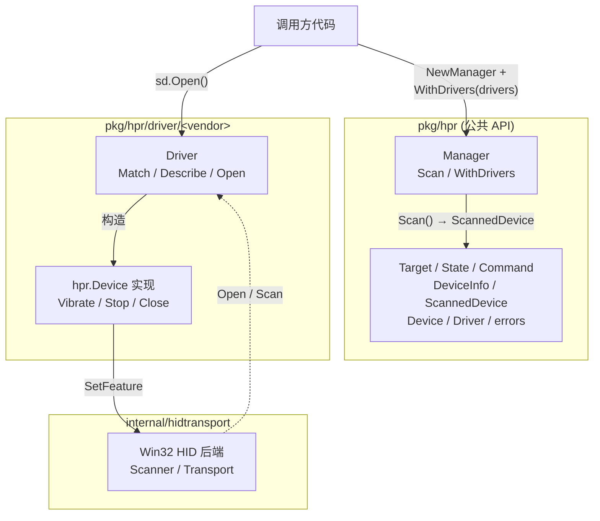

# tracklogic-peripherals

赛车模拟器外设的 Go 驱动库。

调用方构造 `hpr.Manager`，注册一个或多个厂家驱动，调 `Scan` 拿到当前可用的设备列表，再对每个 `ScannedDevice` 调 `Open` 拿一个 `hpr.Device` 来发振动命令。厂家驱动作为 `pkg/hpr/driver/<vendor>/` 子包存在，是调用方和真实硬件之间的薄薄一层。

驱动作者的责任只有三件事：

1. **`Match`** — 根据 `DeviceInfo`（VID/PID/Usage/FriendlyName）判断这个 Driver 是否认领该设备。
2. **`Describe`** — 给 `DeviceInfo` 填厂家私有字段（通常是 `Model`，让调用方能识别型号）。
3. **`Open`** — 拿到 `DeviceInfo`，自己开 transport，构造 `hpr.Device` 实例返回。后续 transport 的关闭由 `Device.Close` 负责。

调用方和驱动作者都看不到彼此的细节：`hpr` 包对厂家和外设种类都无感，厂家包对上层如何暴露也无需关心。详见下面的 [扩展：编写新驱动](#扩展编写新驱动)。

## 状态

**v1.0.0** — 仅 Windows。当前已支持的设备：

| 厂家    | 包                       | 型号                                          |
| ------- | ------------------------ | --------------------------------------------- |
| Simagic | `pkg/hpr/driver/simagic` | P500、P700、P1000、P2000、Alpha Pedal Neo     |

## 安装

```sh
go get github.com/tracklogic/tracklogic-peripherals
```

## 快速上手

```go
package main

import (
    "log"
    "time"

    "github.com/tracklogic/tracklogic-peripherals/pkg/hpr"
    "github.com/tracklogic/tracklogic-peripherals/pkg/hpr/driver/simagic"
)

func main() {
    mgr := hpr.NewManager(hpr.WithDrivers(simagic.NewDriver()))

    devices, err := mgr.Scan()
    if err != nil || len(devices) == 0 {
        log.Fatal("未找到设备")
    }

    dev, err := devices[0].Open()
    if err != nil {
        log.Fatal(err)
    }
    defer dev.Close()

    if err := dev.Vibrate(hpr.Command{
        Target:    hpr.TargetBrake,
        State:     hpr.On,
        Frequency: 30,
        Amplitude: 80,
    }); err != nil {
        log.Fatal(err)
    }

    time.Sleep(time.Second)
    dev.Stop(hpr.TargetBrake)
}
```

完整步骤：

1. `NewManager` 构造
2. `WithDrivers(...)` 注册要识别的厂家驱动
3. `Scan` 拿设备列表
4. 选一个 `ScannedDevice`，调它的 `Open` 拿到 `Device`
5. `Vibrate` / `Stop` / `Close`

## 命令行示例

`examples/hpr-demo` 是可独立运行的示例程序，`go run` 或 `go build` 都行：

```sh
go run ./examples/hpr-demo -list
go run ./examples/hpr-demo -ch 1 -f 30 -a 80 -d 2s

go build -o hpr-demo.exe ./examples/hpr-demo
./hpr-demo.exe -list
```

## 公共 API

`pkg/hpr` 包对外的全部类型：

```go
// 命令数据
type Target uint8           // TargetClutch / TargetBrake / TargetThrottle
type State uint8            // Off / On
type Command struct {       // Vibrate 的入参
    Target    Target
    State     State
    Frequency uint8         // 0..50
    Amplitude uint8         // 0..100
}

// 设备视图
type DeviceInfo struct {    // Scan 返回的描述
    Model          any      // 厂家私有（type-assert 到 simagic.Model 等）
    DevicePath     string
    FriendlyName   string
    Manufacturer   string
    Product        string
    VendorID       uint16
    ProductID      uint16
    VersionNumber  uint32
    UsagePage      uint16
    Usage          uint16
}

type ScannedDevice struct { // Scan 返回
    Info DeviceInfo
    Open func() (Device, error)
}

type Device interface {     // Open 返回
    Info() DeviceInfo
    Vibrate(Command) error
    Stop(Target) error
    Close() error
}

type Driver interface {     // 注册到 Manager 的扩展点
    Match(DeviceInfo) bool
    Describe(DeviceInfo) DeviceInfo
    Open(DeviceInfo) (Device, error)
}

// 入口
func NewManager(opts ...Option) *Manager
func WithDrivers(drivers ...Driver) Option
func (m *Manager) Scan() ([]ScannedDevice, error)

// 错误
var ErrNoDevices = ...
var ErrDeviceClosed = ...
var ErrUnsupported = ...
```

整个 surface 就这些。

## 架构



驱动作者只看到左侧的 `Driver` 接口和右侧的 `hidtransport` Win32 API：`pkg/hpr` 对厂家无知，`internal/hidtransport` 对上层无知。中间的 driver 包是同时 import 二者的那一层。

## 扩展：编写新驱动

```go
package myvendor

import (
    "github.com/tracklogic/tracklogic-peripherals/internal/hidtransport"
    "github.com/tracklogic/tracklogic-peripherals/pkg/hpr"
)

type Driver struct{}

func NewDriver() *Driver { return &Driver{} }

// Match: 这个 Driver 认领哪些设备
func (Driver) Match(info hpr.DeviceInfo) bool {
    // 按 VID/PID / Usage / FriendlyName 判断
    return info.VendorID == 0x1234 && info.ProductID == 0x5678
}

// Describe: 给 DeviceInfo 填厂家私有字段（通常是 Model）
func (Driver) Describe(info hpr.DeviceInfo) hpr.DeviceInfo {
    info.Model = ModelMyProduct
    return info
}

// Open: 拿到一个 hpr.Device，自己负责 transport 生命周期
func (Driver) Open(info hpr.DeviceInfo) (hpr.Device, error) {
    t, err := hidtransport.Open(hidtransport.DeviceDescriptor{
        DevicePath: info.DevicePath,
    })
    if err != nil {
        return nil, err
    }
    return &device{info: info, transport: t}, nil
}

type device struct {
    info      hpr.DeviceInfo
    transport *hidtransport.Transport  // 或自定义 backend
    // ... 任何 driver 需要的私有状态
}

// 实现 hpr.Device：Info / Vibrate / Stop / Close
func (d *device) Close() error {
    // 先把所有 target 停掉（如果适用），再关 transport
    return d.transport.Close()
}
```

注册：

```go
mgr := hpr.NewManager(hpr.WithDrivers(
    simagic.NewDriver(),
    myvendor.NewDriver(),
))
```

注册顺序决定优先级 ——`Scan` 遍历 driver，第一个 `Match` 赢。

## 平台支持

| 操作系统 | 状态      |
| -------- | --------- |
| Windows  | ✅ v1.0   |
| macOS    | ❌ 不支持 |
| Linux    | ❌ 不支持 |

非 Windows 平台**不提供运行时 stub**——`internal/hidtransport` 直接调 Win32 API，跨平台时构建会失败。等到加新平台时再补。

## 测试

仓库**没有单元测试**。这是驱动层代码，单元测试只能验证"代码按我以为的方式组合"，无法验证"设备真的响应"。`go vet` 和 `go build` 是仅有的静态检查；回归靠真硬件手动验证：

```sh
# 1. 插上踏板，确认能看到
go run ./examples/hpr-demo -list

# 2. 让刹车震 2 秒
go run ./examples/hpr-demo -ch 1 -f 30 -a 80 -d 2s
```

`StopAll`、`OpenFirst`、`Capabilities`、`DeviceInfo.DriverName` 之类的方法/字段在 1.0.0 之前都被去掉了——它们曾是"未来扩展性"的占位，但实际用途都是臆想。库只保留调用方真实需要的东西。

## 目录结构

```
.
├── pkg/
│   └── hpr/
│       ├── doc.go                       # 包注释
│       ├── types.go                     # 公开 API
│       ├── manager.go                   # Manager + Windows HID init
│       └── driver/
│           └── simagic/                 # Simagic 驱动
├── internal/
│   └── hidtransport/
│       └── windows.go                   # Win32 HID 后端
└── examples/
    └── hpr-demo/                        # 可运行的示例程序
```

## 许可证

MIT。详见 [LICENSE](LICENSE)。